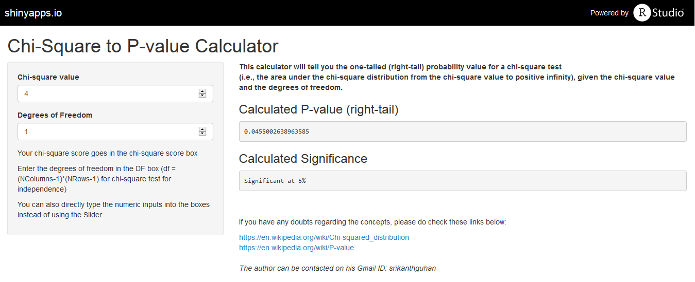

## The Present Scenario

Suppose I ask you to find the p-value to check the significance of a Chi-Square value with given degrees of freedom

Your Standard procedure would be to:  

1. Open the Chi-Square to p-value table
2. Find the value with the given parameters
3. Report it

Let's check this in the next slide, how you would be doing it...  

--- &twocol w1:40% w2:60%
## This is how we do it currently...

*** =left
    
<html>

</html>

*** =right

_But what if you wanted the p-value_  

- with more precision?
- with higher degrees of freedom?
- with chi-square values not in the table?  
  
  
  
Then comes the use of the awesome App mentioned in this link:  

<html>
<link>
https://srikanthguhan.shinyapps.io/Shiny
</link>
</html>  

Go ahead! Click on it.  
I assure you it's not spam! ;)

--- 
## So here's the general layout of the app
  
<html>

</html>  
###  What happens in the back?

For chi-square value of 4 with 1 degree of freedom:

```r
pchisq(q = 4 , df = 1 , lower.tail = F)
```

```
## [1] 0.04550026
```

--- {tpl: thankyou}
## Thank you for your time

Hope you enjoyed it!  
Suggestions and corrections are most welcome  
